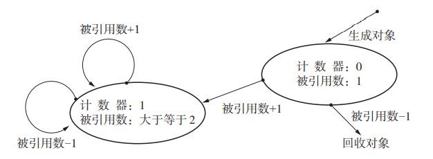

# GC学习

### 前言

《垃圾回收的算法与实现》读书笔记，其中的代码大多为伪代码

### 一：概念

GC，Garbage Collection，垃圾回收

功能

- 找到内存中的垃圾
- 回收垃圾

#### 为什么需要GC

如果没有GC，程序员需要手动进行内存管理，开发麻烦，容易引发内存泄漏、野指针，而且因此导致的BUG很难被定位，修复麻烦

如果有GC，就可以避免这些问题

#### GC的种类

- 标记清除法
- 引用计数法
- GC复制法

#### GC的选取

- 最大暂停时间短：游戏
- 整体处理时间短：音频编码

#### 对象

这里的对象并不是OOP里的Object，而是**被应用程序使用的数据的集合**，对象由**头**和**域**构成

- 头（header）：包含对象的大小和种类

- 域（field）：参考OOP里的成员

对象分为活动对象和非活动对象，GC会保留活动对象，销毁非活动对象

#### mutator

可以简单理解为应用程序，在程序运行过程中，会分配/调用/改变对象（只能操作活动对象），伴随着mutator运行，会产生垃圾

#### GC算法的评估标准

- 吞吐量（throughput）：单位时间的处理能力
- 最大暂停时间（在进行GC时，mutator会被暂停）
- 堆使用效率
- 访问局部性

### 二：标记清除法

*学这一节之前想想操作系统里文件系统*

该算法分为两步

1. 标记阶段：将所有活动对象做上标记
2. 清除阶段：将所有没被标记的对象回收

#### 标记阶段

1. 通过根，找到直接引用的对象，标记
2. 递归标记所有能访问到的对象（常用深搜，因为内存使用量更少）

```c++
void mark(obj){
	if(!obj.mark) 
        obj.mark = true;
	for(child: obj.children) 
        mark(*child);
}
```

#### 清除阶段

遍历堆，回收所有没有被标记的对象，并将其放入空闲链表，以备分配

#### 分配策略

在创建新对象`obj`时，遍历空闲链表，寻找合适的块，这里使用First-fit算法（因为快）

- First-fit：找到第一个能放下`obj`的块
- Best-fit：找到最小的能放下`obj`的块
- Worst-fit：找到最大的能放下`obj`的块

#### 合并策略

分配和回收会导致大量小的分块，于是需要合并，在这里直接遍历堆，将连续的空闲块合并

#### 评价

优点

- 实现简单
- 与保守式GC兼容（因为对象不会被移动）

缺点

- 碎片化，导致空间浪费，访问性能降低
- 不支持**写时复制**（比如UNIX中的`fork()`）

#### 优化方案

##### 分级空闲链表

使用多个空闲链表，分别只连接不同大小的分块，分配时先找所对应的区间，可以提高性能

##### BiBOP（Big Bag Of Pages）

将大小相近的对象整理成固定大小的块进行管理

- 碎片化的原因之一是杂乱散布的大小各异的对象，如果将堆固定分割，就可以减缓碎片化

##### 位图标记

不直接堆对象进行标记，而是记录对象的标志位，存储在一个表格中

- 与写时复制技术兼容（因为不会修改对象本身，可以复用）
- 清除标志位更高效（只需要把表中要清除的对象的标志位改成一个特殊值）

##### 延迟标记清除法

- 分配时，先调用清除，如果能清出足够的空间来分配，则直接分配，否则进行普通的标记操作
- 清除时，同样是First-fit遍历堆，但遍历的起点是上次开始的地点的右侧
- 延迟的内核是不主动清除，而是等到要分配时再清除

### 三：引用计数法

*学这一节前，想想智能指针*

引用计数法中，对象会记录自己被引用次数，主要分为两个阶段

1. 创建新对象：分配内存，将对象引用次数设为1
2. 更新指针：先增后减计数器值，若引用次数为0则回收

```c++
//更新指针ptr，让其指向obj
void update_ptr(ptr, obj){	
	inc_ref_cnt(obj);	//obj要被ptr引用了，所以obj计数值++
    dec_ref_cnt(*ptr);	//ptr之前引用的东西不再被引用
    *ptr = obj;
}
void dec_ref_cnt(obj){
    obj.ref_cnt--;	//obj不再被引用，所以计数值--
    if(obj.ref_cnt == 0){	//如果obj没人用了，obj就要被清除
        for(child: obj.children){	//obj被清除了，那obj引用的对象，被引用次数要--
            dec_ref_cnt(*child);
        }
        reclaim(obj);	//执行回收
    }
}
```

#### 评价

优点：

- 对象变成垃圾时立刻被回收（延迟标记清除算法要等到分块用尽后才开始回收垃圾）
- 最大暂停时间短（只有在更新指针的时候才会打断mutator）
- 减少延根指针遍历所有子节点的次数（尤其在分布式系统中，效果显著）

缺点

- 频繁进行计数值的操作
- 计数器本身空间比较大（32位系统的计数器就要32位大小）
- **循环引用无法回收**
  - 如果两个物体互相引用，并不和其他对象有联系，于是他们成为了一座“孤岛”，成为了事实意义上的垃圾，但是却无法被回收（因为只要被引用，就不算垃圾）

#### 优化方案

##### 延迟引用计数法

解决频繁操作

- 使用ZCT表（Zero Count Table），记录所有执行`dec_ref_cnt`后计数值变成0的对象（也就是说计数值变成0，不会立刻被视为垃圾回收），当ZCT表满了以后，开始回收表中的对象
- 优点：延迟了根引用的计数（只有要回收时才会一起操作），降低了计数值的操作频率
- 缺点
  - 不再能即刻回收垃圾（你可以理解为以前有垃圾就仍，现在要先堆一波垃圾再扔）
  - 最大暂停时间延长（`scan_zct()`要访问整个ZCT，这个过程muator是被中断的）

```c++
void dec_ref_cnt(obj){
    obj.ref_cnt--;
    if(obj.ref_cnt == 0){	//计数值变为0，可能会变成垃圾
        if(is_full($zct)){
            scan_zct();		//如果zct表满了，就扫描zct，并回收
        }
        push($zct, obj);	//将obj放入zct表
    }
}
void scane_zct(){
    fot(r: $root){
        (*r).ref_cnt++;	//根直接引用的对象的计数器++，直接引用计数时，根会极频繁改动
    }
    for(obj: $zct){
        if(obj.ref_cnt == 0){
            remove($zct, obj);
            delete(obj);
        }
    }
    fot(r: $root){
        (*r).ref_cnt--;	
    }
}
```

##### Sticky引用计数法

解决空间浪费

32位电脑意味着可以有$2^{32}$个对象，这些对象可能都会引用`obj`，所以`obj`的计数位应当可以记录被引用$2^{32}$次，所以计数位要有32位

如果计数位太少，一些比较大的对象就无法正常表示（直接做饱和运算，汽车速度超过速度计的最大值会停在最大值处），一旦出现这种情况，我们可以

- 什么都不做
  - 这会导致如果一个物体被引用的次数特别多，超出了目前表示的范围，即使他变成了垃圾也无法回收
  - 但是，事实上绝大多数对象计数值一直在0和1间变化（生成后立刻回收），所以很少出现溢出
  -  而且一个对象被频繁引用，说明他十分重要，十分重要的东西被回收的概率并不大
  - 很多时候不需要保证内存永不泄露，只需要保证一段时间内不泄露就行，很多软件，用户不会一直开着的
- 结合使用标记清除算法
  - 什么都不做，可能会导致内存耗尽，如果耗尽，那就用标记清除法清一次（相当于垃圾太多了，管不来了，就干脆来一次大扫除）

```c++
//标记
void mark(){	
    for(r: $roots){
        push(*r, $stack);	//将所有根直接引用对象入栈
    }
    while(!$stack.empty()){
        obj = pop($stack);
        obj.ref_cnt++;
        if(obj.ref_cnt == 1){	//这说明obj只进栈一次
            for(child: obj.children){
                push(*child, $stack);
            }
        }
    }
}
//清除
void sweep(){
    index = $heap_top;
    while(index < $heap_end){	//遍历整个堆
        if(index.ref_cnt == 0){
            reclaim(index);		//回收计数值为0的对象
        }
        index += index.size;
    }
}
```

##### 一位引用计数法

是Sticky的极端，计数位只有一位（两个tag，一个MULTIPLE，一个UNIQUE），而且将计数位放在指针上，而非放在对象上



```c++
void copy_ptr(dest_ptr, src_ptr){
    delete_ptr(dest_ptr);
    *dest_ptr = *src_ptr;
    set_tag(dest_ptr, MULTIPLE);
    if(src_ptr.tag == UNIQUE){
        set_tag(src_ptr, MULTIPLE);
    }
}
void delete_ptr(ptr){
    if(ptr.tag == UNIQUE)	
        reclaim(*ptr);	//如果对象以前只被引用一次，那么这次就要被回收
}
```

优点

- cache命中率高

缺点

- 同Sticky，而且更严重

##### 部分标记清除法

解决循环引用

只对可能会有循环引用的对象使用标记清除法，其他对象使用引用计数法

每个对象会有两个状态位（于是就有四个状态），分别为

- BLACK：绝对不是垃圾的对象（初始值）
- WHILE：绝对是垃圾的对象
- GRAY：搜索完毕的对象
- HATCH：可能是循环垃圾的对象

```c++
void dec_ref_cnt(obj){
    obj.ref_cnt--;
    if(obj.ref_cnt == 0){
        delete(obj);
    }
    else if(obj.color != HATCH){
        obj.color = HATCH;
        queue.push(obj);
    }
}
```

对放入队列的对象进行标记清除算法

```c++
Object new_obj(size){
    obj = pickup_chunk(size);	//分配内存
    if(obj != null){	//如果分配成功
        obj.color = BLACK;
        obj.ref_cnt = 1;
        return obj;
    }
    else if(!queue.empty()){	//说明现在空间不足，要回收垃圾，先看是否存在HATCH物体
        scan_hatch_queue();		
        return new_obj(size);	//回收queue内后重新尝试分配
    }
    else{
        allocation_fall();
    }
}
void scan_hatch_queue(){	//循环扫描队列，直至队列为空
    obj = queue.pop();
    if(obj.color == HATCH){
        paint_gray(obj);	//把obj和其孩子变为GRAY，孩子们引用值--
        scan_gray(obj);		//引用值>0涂黑，等于0涂白
        collect_while(obj);
    }
    else if(!queue.empty()){
        scane_hatch_queue();
    }
}
void paint_gray(obj){
    if(obj.color == (BLACK | HATCH)){	
        obj.color = GRAY;	
        for(child: obj.children){
            (*child).ref_cnt--;
            paint_gray(*child);
        }
    }
}
void scan_gray(obj){
    if(obj.color == GRAY){
        if(obj.ref_cnt > 0){
            paint_black(obj);
        }
        else{
            obj.color = WHITE;
            for(child: children(obj)){
                scan_gray(*child);
            }
        }
    }
}
void paint_black(obj){
     obj.color = BLACK;
	 for(child : children(obj)){
		(*child).ref_cnt++
		if((*child).color != BLACK){
			paint_black(*child)            
        }          
     }		
}
void collect_while(){
    if(obj.color == WHILE){
        obj.color = BLACK;
        for(child: obj.children){
            collect_while(*child);
        }
        reclaim(obj);
    }
}
```

优点

- 可以回收循环引用

缺点

- 一个对象要被查找三次，导致最大暂停时间+++

### 四：GC复制法


